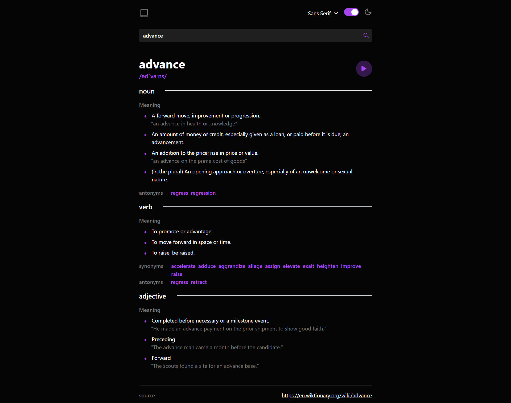
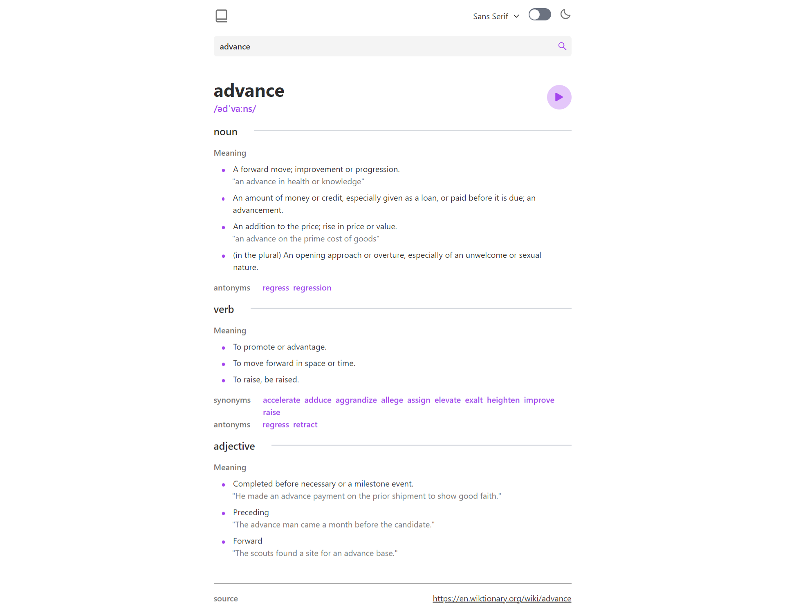

# Frontend Mentor - Dictionary web app solution

This is a solution to the [Dictionary web app challenge on Frontend Mentor](https://www.frontendmentor.io/challenges/dictionary-web-app-h5wwnyuKFL). Frontend Mentor challenges help you improve your coding skills by building realistic projects.

## Table of contents

- [Overview](#overview)
  - [The challenge](#the-challenge)
  - [Screenshot](#screenshot)
  - [Links](#links)
- [My process](#my-process)
  - [Built with](#built-with)
  - [What I learned](#what-i-learned)
  - [Continued development](#continued-development)
  - [Useful resources](#useful-resources)
- [Author](#author)
- [Acknowledgments](#acknowledgments)

**Note: Delete this note and update the table of contents based on what sections you keep.**

## Overview

### The challenge

Users should be able to:

- Search for words using the input field
- See the Free Dictionary API's response for the searched word
- See a form validation message when trying to submit a blank form
- Play the audio file for a word when it's available
- Switch between serif, sans serif, and monospace fonts
- Switch between light and dark themes
- View the optimal layout for the interface depending on their device's screen size
- See hover and focus states for all interactive elements on the page
- **Bonus**: Have the correct color scheme chosen for them based on their computer preferences. _Hint_: Research `prefers-color-scheme` in CSS.

### Screenshot
Dark


Light


### Links

- Solution URL: [Github](https://github.com/Nwachukwu-Uzor/english-dictionary-react)
- Live Site URL: [Here](https://english-dictionary-react.vercel.app/)

## My process

### Built with

- Semantic HTML5 markup
- TailwindCSS
- Mobile-first workflow
- [React](https://reactjs.org/) - JS library
- [flowbite-react](https://www.flowbite-react.com/) - A tailwind CSS component library for ReactJS. Provided toggle button and fonts dropdown component.

**Note: These are just examples. Delete this note and replace the list above with your own choices**

### What I learned

Use this section to recap over some of your major learnings while working through this project. Writing these out and providing code samples of areas you want to highlight is a great way to reinforce your own knowledge.

To see how you can add code snippets, see below:

```html
<h1>Some HTML code I'm proud of</h1>
```

```css
.proud-of-this-css {
  color: papayawhip;
}
```

```js
const proudOfThisFunc = () => {
  console.log("🎉");
};
```

If you want more help with writing markdown, we'd recommend checking out [The Markdown Guide](https://www.markdownguide.org/) to learn more.

### Useful resources

- [Setting theme base on user's preferred theme](https://stackoverflow.com/questions/56393880/how-do-i-detect-dark-mode-using-javascript) - This stackoverflow post helped me figure out how to set user's color scheme on inital load to dark or light on initial load based off the user's browser theme settings.

## Author

- Website - [Uzor Nwachukwu](https://www.your-site.com)
- Frontend Mentor - [@Nwachukwu-Uzor](https://www.frontendmentor.io/profile/Nwachukwu-Uzor)
- Twitter - [@nwachukwu_uzor](https://www.twitter.com/Uzor_Nwachukwu)
